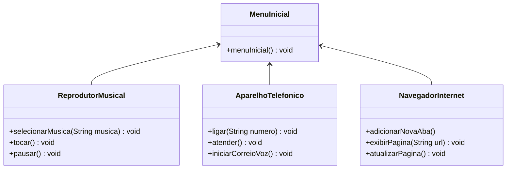

## DESAFIO DIO 
  > Repositório criado para o desafio do conteudo estudado UML.
 

```mermaid
classDiagram
    class ReprodutorMusical {
        +selecionarMusica(String musica)void
        +tocar()void
        +pausar()void
    }

    class AparelhoTelefonico {
        +ligar(String numero)void
        +atender()void
        +iniciarCorreioVoz()void
    }

    class NavegadorInternet {
        +adicionarNovaAba()
        +exibirPagina(String url)void
        +atualizarPagina()void
    }

    class MenuInicial {
      +menuInicial()void
    }

    MenuInicial <-- ReprodutorMusical
    MenuInicial <-- AparelhoTelefonico
    MenuInicial <-- NavegadorInternet
```

